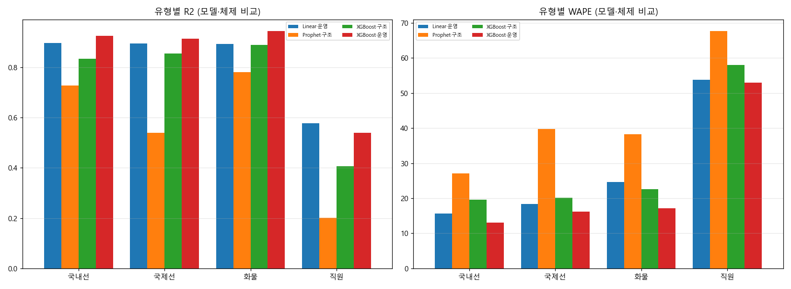
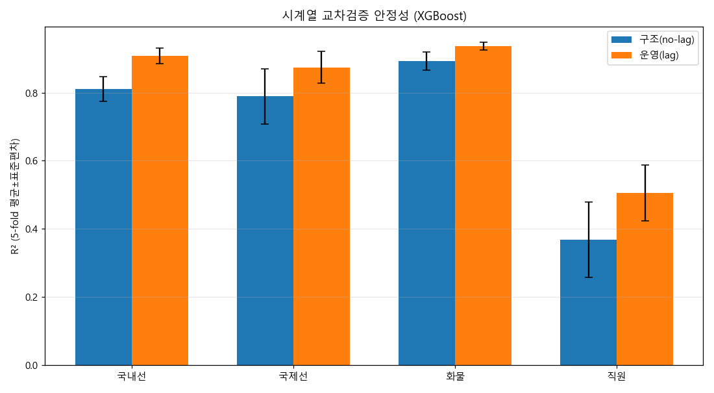
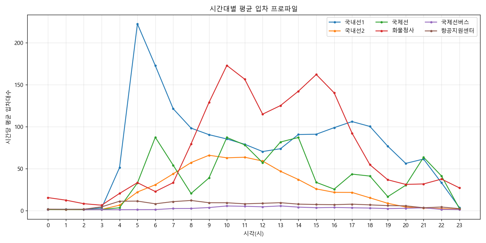
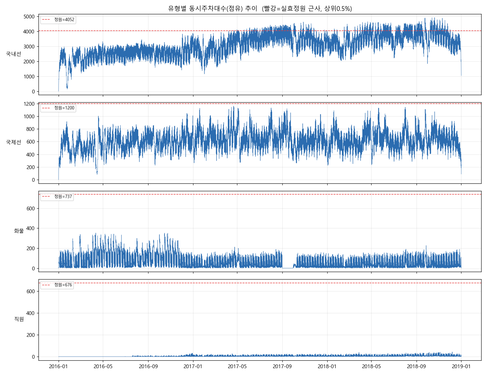

# 김포공항 주차수요 분석 · 예측 (2016~2018)

김포국제공항 6개 주차장의 **주차관제시스템 입·출차 전수 데이터(563만 건)** 를 정제·분석하고,
**시간당 주차수요 예측 모형**을 구축한 프로젝트. 최종 목표는 교통센터(주차빌딩) 신축사업의
**장래 수요·편익 분석**(시나리오)이다.

> ⚠️ **원본 데이터는 저장소에 포함되지 않습니다.** raw(.xls) 약 2.5GB + 개인정보 포함 → `.gitignore` 제외. **코드만** 버전 관리.

---

## 핵심 결과 요약

| 유형 | 운영형(lag) R² | 구조형(시나리오용) R² | 5-fold CV R²(운영) |
|---|---|---|---|
| 화물 | **0.944** | 0.889 | 0.936 ± 0.011 |
| 국내선 | **0.925** | 0.835 | 0.908 ± 0.023 |
| 국제선 | **0.914** | 0.867 | 0.874 ± 0.047 |
| 직원 | 0.540 | 0.406 | 0.506 ± 0.082 |

- **두 예측 체제**: ① 운영형(lag 사용, 단기 예측 R²0.91~0.94) ② 구조형(lag 제외, 미래 시나리오용 R²0.84~0.89)
- 모델 우열: **XGBoost ≳ RandomForest > Linear ≫ Prophet**
- **데이터 정제(요금0원 비주차 제외)가 어떤 외부데이터보다 큰 개선** — 직원 구조형 R² 음수→+0.41




---

## 주요 인사이트

1. **국내선 만성 초과수요** — 최대 점유 **122%**(정원 4,052대, 주차대행 overflow), 만차일수(공식) 국내1P 연 **365일**, 입차 탐색시간 2014년 2:40→2015년 5:26. → **신축 정당성의 정량 근거.**
2. **수요 동인이 주차장별로 완전히 다름** — 국내선 새벽5시 피크(여객), 화물 업무시간 쌍봉(물류). → 통합이 아닌 **유형별 개별 모형**이 타당.
3. **"여객→주차" 관계가 공식자료 대비 98% 일치** — 여객 예측 기반 장래수요 추정의 신뢰 기반.
4. **주차가 항공 출발을 2시간 선행**(교차상관 검증) — 수속·보안·대기·쇼핑 리드타임.




---

## 데이터

### 원본 (로컬, 비공개)
김포공항 6개 주차장(국내선1·2, 국제선, 화물청사, 국제선버스, 항공지원센터) 2016~2018 입·출차 전수.
경로는 PC별로 다르므로 **코드 수정 없이** 환경변수 `KIMPO_DATA_DIR` 또는 `src/data_dir.local.txt`로 지정(config.py 자동 인식).

### ⚠️ 데이터 사용 필수 주의사항
1. **주차권번호 `9999999` 제외** (출차완료 차량 재출차 허수).
2. **요금 0원 = 비주차 통행**(유예 10분 내 드롭오프/U턴/만차회차) — 주차수요에서 제외. 미제외 시 화물 ~50%·직원 ~67% 과대.
3. **2016년 연중 ~22~28% 과소집계**(DB 누락) — 수준값 신뢰 낮음. 2017~18 권장.
4. 국제선버스 2016-02-06, 항공지원센터 2016-07-20 운영 시작.

### 외부 데이터 (`data/external/`, 자동 수집/결합)
| 데이터 | 출처 | 수집 |
|---|---|---|
| 항공 일별 운항·여객·화물 | 항공정보포털 | `fetch_flights.py` |
| 항공 시간대별(출발/도착) | KAC 시간대통계 | `fetch_flights_hourly.py` |
| 기상 시간자료(서울108 ASOS) | 기상청 data.go.kr | `fetch_weather.py` |
| 정원·만차일수·요금·이용실적 | KAC 신축사업 자료 | (참조) |

---

## 파이프라인 (`src/`)

| 모듈 | 역할 |
|---|---|
| `config.py` | 경로, 주차장 정규화, 4유형 매핑, 실제 정원, 상수 |
| `etl.py` | .xls 공통 리더 (포맷차이·멀티시트·날짜혼재 흡수) |
| `aggregate.py` | 전 파일→트랜잭션 마스터 + 일/시간 집계 (중복·구간·요금0 처리) |
| `eda.py` | 탐색 시각화 (시간/요일/계절/체류/상관) |
| `occupancy.py` | 입·출차 누적으로 동시주차(점유율%) 복원 |
| `features.py` | 4유형 시간당 특성행렬 (달력·공휴일·연휴·lag·외부결합) |
| `fetch_flights*.py` / `fetch_weather.py` | 외부데이터 수집 |
| `lead_analysis.py` | 주차→출발 선행시간 교차상관 추정 |
| `model_ml.py` | Linear/RF/XGBoost (운영형·구조형) |
| `model_ts.py` | Prophet (시계열 비교군) |
| `evaluate.py` / `evaluate_compare.py` | 지표(MAE/RMSE/MAPE/WAPE/R²) + 통합비교·교차검증 |
| `balking_analysis.py` | 점유율↔비주차회차 관계 |
| `validate_official.py` | 공식 월별 대비 재구성 검증 |

**실행 순서**: `aggregate.py` → `occupancy.py` → (`fetch_*`) → `features.py` → `model_ml.py [structural]` → `model_ts.py` → `evaluate_compare.py`

---

## 재현

```bash
pip install -r requirements.txt
# 데이터 경로 지정 후
python src/aggregate.py          # 트랜잭션 마스터·집계
python src/features.py           # 특성행렬
python src/model_ml.py           # 운영형
python src/model_ml.py structural # 구조형(시나리오용)
python src/evaluate_compare.py   # 비교·교차검증
```

---

## 한계 · 향후 (#7 시나리오)

- **직원(항공지원센터)** 은 자체 성장추세라 외부변수로 설명 한계(구조형 R²0.41).
- **장기예측(2026/27)** 은 ① 2023~25 재학습(코로나 구조변화) ② 항공 장래수요 투입 ③ 시나리오 밴드 필요.
- **#7 시나리오/편익**(신규시설 Do/Do-not, 시간절감·초과수요 해소)은 (a) 2018 항공이동행동조사 설문, (b) 2023~25 주차 raw — **정보공개청구 회신 대기 중**. 청구 명세: `docs/정보공개청구_주차데이터_명세.md`.

산출 그래프: `reports/figures/`, 상세 보고서: `docs/분석보고서.md`.
